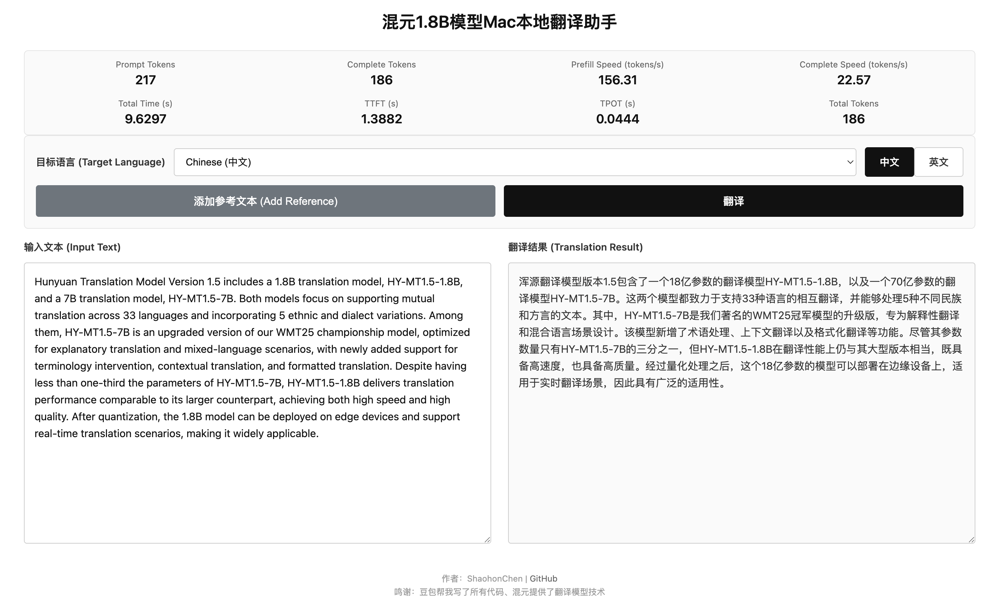

# HY-MLX-Translator - Hunyuan 1.8B Model Local Translation Assistant for Mac

> A local translation website deployed on Apple Silicon Mac using MLX, based on Tencent Hunyuan 1.8B model. Supports streaming translation results for real-time translation experience.
> ⚠️ 99% of this project's code is implemented by vibe coding! There may be some bugs or imperfections. Please use with caution.

<p align="center">
  
</p>

Since Google Translate often doesn't work properly due to network issues, I decided to create a local translation assistant. Since I use a Mac computer, I adopted the [MLX-LM framework](https://github.com/MLX-LM/MLX-LM) as the inference engine to accelerate LLM running speed on Mac.

For model selection, I chose the [Tencent Hunyuan 1.8B model](https://huggingface.co/tencent/HY-MT1.5-1.8B) because it claims on Huggingface to have excellent translation performance, with the original statement being "achieving industry-leading level among models of the same scale, surpassing most commercial translation APIs" (I haven't compared it with other models of the same parameters). Subjectively, this model can provide high-quality translation results in paper translation scenarios.

|  |
|:--:|
|  |
| *Translation Assistant Interface (Since it's a productivity tool, the interface is kept as simple as possible)* |

## Project Features

- 🍎 **Mac-friendly**: Runs completely locally and is fast on Apple M-series chips
- 🌍 **Multi-language support**: Supports translation in 33 languages (of course, mainly thanks to Hunyuan's excellence)
- ⚡ **Streaming output**: Displays translation results in real-time without waiting for complete generation
- 📝 **Reference translation**: Supports adding reference text to improve translation quality
- 📊 **Performance statistics**: Real-time display of Tokens count, total time, TTFT, TPOT and other performance indicators

## Technology Stack

- **Backend**: Flask + Flask-CORS
- **Framework**: MLX-LM (Apple Silicon optimized)
- **Model**: HY-MT1.5-1.8B (Tencent Hunyuan)
- **Frontend**: Native HTML + CSS + JavaScript

## Local Running Steps

### 1. Install Dependencies

```bash
pip install flask flask-cors mlx-lm
```

### 2. Download Model

```bash
bash download_model.sh
```

This script will download the `tencent/HY-MT1.5-1.8B` model from HuggingFace to the local `HY-MT1.5-1.8B/` directory.

### 3. Start Service

```bash
python app.py
```

After the service starts, access `http://127.0.0.1:5000` in your browser to use it.

### 3.1 Customize host and port

To specify host or port, you can use command-line parameters:

```bash
python app.py --host 0.0.0.0 --port 8080
```

Parameter description:
- `--host`: Specify listening address (default: `127.0.0.1`)
- `--port`: Specify port number (default: `5000`)

## Exposing Service Externally

By default, the service only listens to the local address (`127.0.0.1`) and can only be accessed on the local machine. To expose the service externally, use the `--host 0.0.0.0` parameter:

```bash
python app.py --host 0.0.0.0 --port 5000
```

After modification, devices within the same local area network can access it through `http://<your Mac's IP>:5000`.

### ⚠️ Security Reminder

- `debug=True` is only for development environments, please set to `False` for production environments
- Please pay attention to network security when exposing services externally, it is recommended to use in a trusted network environment
- If you need to access it on the public network, it is recommended to use Nginx reverse proxy and configure HTTPS

## API Interface Description

### 1. Get Supported Language List

```http
GET /api/languages
```

Response example:
```json
{
  "languages": {
    "Chinese": "中文",
    "English": "英语",
    ...
  },
  "quick_langs": [
    {"key": "Chinese", "label": "中文"},
    {"key": "English", "label": "英文"}
  ]
}
```

### 2. Translation Interface (Streaming Output)

```http
POST /api/translate
Content-Type: application/json

{
  "text": "Text to be translated",
  "target_language": "Chinese",
  "request_id": "1234567890",
  "refer_text": "Reference text (optional)"
}
```

The response uses Server-Sent Events (SSE) to return streaming data.

### 3. Cancel Translation

```http
POST /api/cancel
Content-Type: application/json

{
  "request_id": "1234567890"
}
```

## Acknowledgments

- Model: Tencent Hunyuan [HY-MT1.5-1.8B](https://huggingface.co/tencent/HY-MT1.5-1.8B)
- Inference framework: [MLX-LM](https://github.com/ml-explore/mlx-lm)
- Code: [Doubao](https://www.doubao.com/chat/)

## License

Please refer to the License.txt file of the HY-MT1.5-1.8B model.